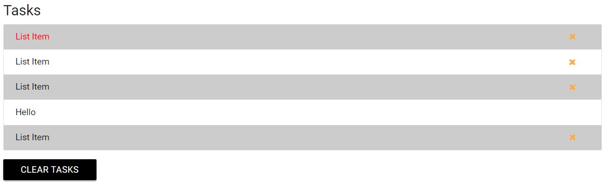
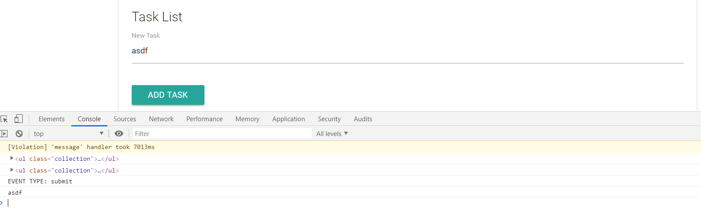
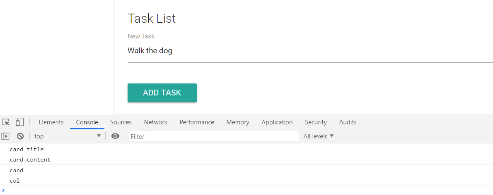
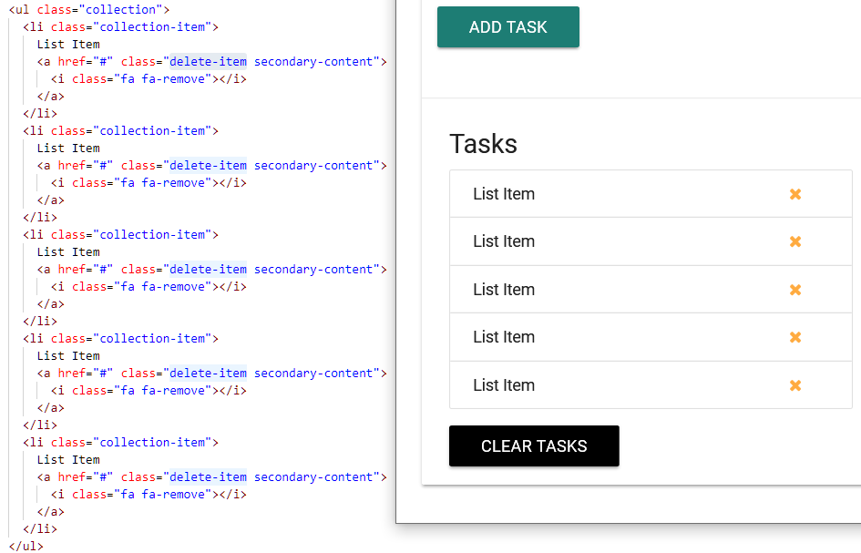
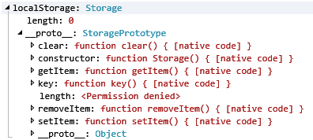
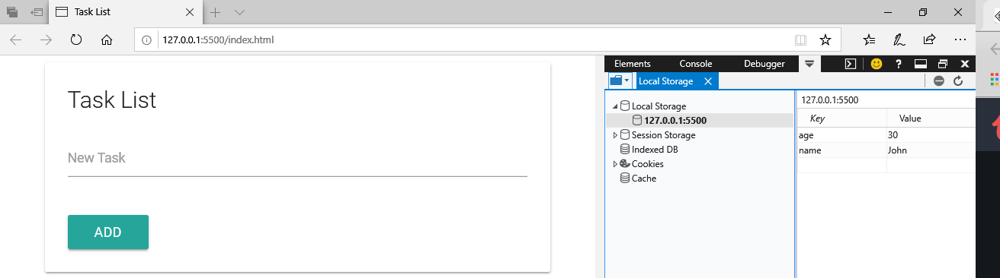
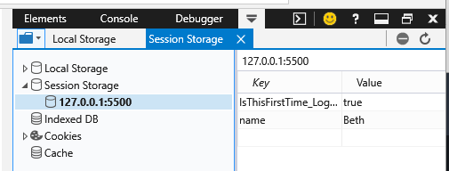
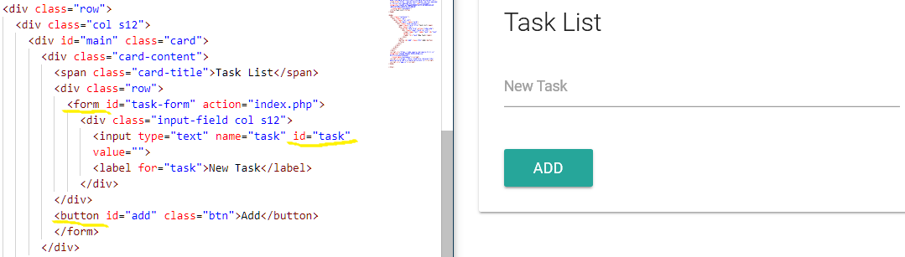
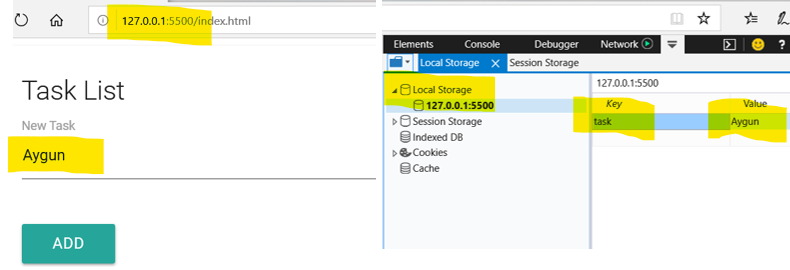
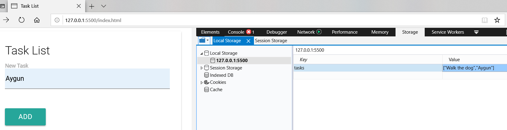

# DOM Manipulation & Events
**Examining the Document object for this project**
- index.html file:
```HTML
<!DOCTYPE html>
<html lang="en">

<head>
    <meta charset="UTF-8">
    <meta name="viewport" content="width=device-width, initial-scale=1.0">
    <meta http-equiv="X-UA-Compatible" content="ie=edge">
    <link rel="stylesheet" href="https://cdnjs.cloudflare.com/ajax/libs/materialize/0.100.2/css/materialize.min.css">
    <link href="https://maxcdn.bootstrapcdn.com/font-awesome/4.7.0/css/font-awesome.min.css" rel="stylesheet"
        integrity="sha384-wvfXpqpZZVQGK6TAh5PVlGOfQNHSoD2xbE+QkPxCAFlNEevoEH3Sl0sibVcOQVnN" crossorigin="anonymous">
    <title>Task List</title>
</head>

<body>
    <div class="container">
        <div class="row">
            <div class="col s12">
                <div id="main" class="card">
                    <div class="card-content">
                        <span class="card-title">Task List</span>
                        <div class="row">
                            <form id="task-form">
                                <div class="input-field col s12">
                                    <input type="text" name="task" id="task" value="Walk the dog">
                                    <label for="task">New Task</label>
                                </div>
                        </div>
                        <input type="submit" value="Add Task" class="btn">
                        </form>
                    </div>
                    <div class="card-action">
                        <h5 id="task-title">Tasks</h5>
                        <ul class="collection">
                            <li class="collection-item">
                                List Item
                                <a href="#" class="delete-item secondary-content">
                                    <i class="fa fa-remove"></i>
                                </a>
                            </li>
                            <li class="collection-item">
                                List Item
                                <a href="#" class="delete-item secondary-content">
                                    <i class="fa fa-remove"></i>
                                </a>
                            </li>
                            <li class="collection-item">
                                List Item
                                <a href="#" class="delete-item secondary-content">
                                    <i class="fa fa-remove"></i>
                                </a>
                            </li>
                            <li class="collection-item">
                                List Item
                                <a href="#" class="delete-item secondary-content">
                                    <i class="fa fa-remove"></i>
                                </a>
                            </li>
                            <li class="collection-item">
                                List Item
                                <a href="#" class="delete-item secondary-content">
                                    <i class="fa fa-remove"></i>
                                </a>
                            </li>
                        </ul>
                        <a class="clear-tasks btn black" href="#">Clear Tasks</a>
                    </div>
                </div>
            </div>
        </div>
    </div>
    <script src="https://code.jquery.com/jquery-3.2.1.js"
        integrity="sha256-DZAnKJ/6XZ9si04Hgrsxu/8s717jcIzLy3oi35EouyE=" crossorigin="anonymous"></script>
    <script src="https://cdnjs.cloudflare.com/ajax/libs/materialize/0.100.2/js/materialize.min.js"></script>
    <script src="app.js"></script>
</body>

</html>
```

```JavaScript
	let val;

	val = document.all[1];
	console.log(val);
/*
	OUTPUT:
	<head>...</head>
*/

	val = document.URL;
	console.log(val);
/*
	OUTPUT:
	http://127.0.0.1:5500/index.html
*/

// val = document.forms[0].id;
	val = document.forms;
	console.log(val);
/*
	OUTPUT:
	HTMLCollection [form#task-form, task-form: form#task-form]
	0: form#task-form
	length: 1
	task-form: form#task-form
	__proto__: HTMLCollection
*/

	val = document.links[0].className;
	console.log(val);
/*
	OUTPUT:
	delete-item secondary-content
*/

	val = document.scripts;
	console.log(val);
/*
	OUTPUT:
	HTMLCollection(3) [script, script, script]
	0: script
	1: script
	2: script
	3: script
	length: 4
	__proto__: HTMLCollection
*/

// you can turn HTML collections into arrays to use forEach looping
	let scripts = document.scripts;
	let scriptsArr = Array.from(scripts);

	scriptsArr.forEach(function(script) {
	  console.log(script.getAttribute('src'));
	});

	console.log(val);
/*
	OUTPUT:
	https://code.jquery.com/jquery-3.2.1.js
	https://cdnjs.cloudflare.com/ajax/libs/materialize/0.100.2/js/materialize.min.js
	app.js
*/
```
## DOM Selectors for Single Elements

### document.getElementById()
```JavaScript
	const taskTitle = document.getElementById('task-title');

// Change styling
	 taskTitle.style.color = 'red';
	 taskTitle.style.padding = '5px';

// Change content
	taskTitle.textContent = 'Task List';
	taskTitle.innerText = 'My Tasks';
	taskTitle.innerHTML = '<span style="color:red">Task List</span>';
```
### document.querySelector()
```JavaScript
// Change styling
	document.querySelector('li').style.color = 'red';
	document.querySelector('ul li').style.color = 'blue';
	document.querySelector('li:last-child').style.color = 'red';
	document.querySelector('li:nth-child(3)').style.color = 'yellow';
	document.querySelector('li:nth-child(even)').style.background = '#f4f4f4';
```
## DOM Selectors for Multiple Elements

### document.getElementsByClassName()
```JavaScript
	const items = document.getElementsByClassName('collection-item');

	console.log(items);
	/* OUTPUT:
	HTMLCollection(5)
		0: li.collection-item
		1: li.collection-item
		2: li.collection-item
		3: li.collection-item
		4: li.collection-item
		length: 5
		__proto__: HTMLCollection
	*/
	console.log(items[0]);  // the first li item in the HtmlCollection

// Change styling

	 items[0].style.color = 'red';
	 items[3].textContent = 'Hello';
```
### document.getElementsByTagName()
```JavaScript
	let lis = document.getElementsByTagName('li');
	console.log(lis);		
 /* OUTPUT - same result as above
    HTMLCollection(5)
        0: li.collection-item
        1: li.collection-item
        2: li.collection-item
        3: li.collection-item
        4: li.collection-item
        length: 5
        __proto__: HTMLCollection
  */ 
	console.log(lis[0]);	// the first li item in the HtmlCollection
 
 // Change styling
 
	 lis[0].style.color = 'red';
	 lis[3].textContent = 'Hello';
```
### document.querySelectorAll()
- querySelectorAll will returns a Node-List
- A Node-List will not just count elements but also Text nodes
- We don’t have to convert it to an array to loop through it
```JavaScript
	 const items = document.querySelectorAll('ul.collection li.collection-item');
	 console.log(items);
	 /* OUTPUT:
		NodeList(5)
		0: li.collection-item
		1: li.collection-item
		2: li.collection-item
		3: li.collection-item
		4: li.collection-item
		length: 5
		__proto__: NodeList
	  */
	 
	 //Change styling/
	 const liOdd = document.querySelectorAll('li:nth-child(odd)');
	 
	 liOdd.forEach(function(li, index){
	   li.style.background = '#ccc';
	 });
```

## Traversing the DOM

### Selecting Elements
```JavaScript
	let val;
	const list = document.querySelector('ul.collection');
/* OUTPUT:
    <ul class="collection">
    <li class="collection-item">...</li>
    <li class="collection-item">...</li>
    <li class="collection-item">...</li>
    <li class="collection-item">...</li>
    <li class="collection-item">...</li>
    </ul>
*/
	const listItem = document.querySelector('li.collection-item:first-child');
	console.log(list);
/* OUTPUT:    
    <li class="collection-item">
        List Item<a class="delete-item secondary-content" href="#">...</a>
    </li>
*/
	val = listItem;
	val = list;
```
### Get Child Nodes
- Will also count the text nodes 
- Returns a nodeList
val = list.childNodes;
```JavaScript
	console.log(list);
/* OUTPUT: 
	<NodeList length="11">
		EmptyTextNode
		<li class="collection-item">...</li>
		EmptyTextNode
		<li class="collection-item">...</li>
		EmptyTextNode
		<li class="collection-item">...</li>
		EmptyTextNode
		<li class="collection-item">...</li>
		EmptyTextNode
		<li class="collection-item">...</li>
		EmptyTextNode
	</NodeList>
*/
	val = list.childNodes[0];
	val = list.childNodes[0].nodeName;
	val = list.childNodes[3].nodeType; // nodeType will returns a number
```
Node Type by number:
- 1 Element
- 2 Attribute (deprecated)
- 3 Text node
- 8 Comment
- 9 Document itself
- 10 Doctype

### Get Children Element Nodes
- Will only count the elements
- Returns an HtmlCollection
val = list.children;
```html
 OUTPUT:
	<HtmlCollection length="5">
		<li class="collection-item">...</li>
		<li class="collection-item">...</li>
		<li class="collection-item">...</li>
		<li class="collection-item">...</li>
		<li class="collection-item">...</li>
	</HtmlCollection>
```
- Get an Element from the Children
```JavaScript
	val = list.children[1];
	list.children[1].textContent = 'Hello';
```
- Children of children
```JavaScript
	val = list.children[3].children;
	list.children[3].children[0].id = 'test-link';
```
- First child
```JavaScript
	val = list.firstChild;  // returns first node, whether it’s an element/text,...
```
- First Element Child
```JavaScript
	val = list.firstElementChild;  // returns first actual element.
```
- Last child
```JavaScript
	val = list.lastChild;  // returns last node, whether it’s an element/text,...
```
- Last Element child
```JavaScript
	val = list.lastElementChild; // returns last actual element.
```
- Count child elements
```JavaScript
	val = list.childElementCount;
```
### Get Parent Node
```JavaScript
	val = listItem.parentNode;
	val = listItem.parentElement; // most cases it will be the same.
```

- Parent of Parent
```JavaScript
	val = listItem.parentElement.parentElement;
```

- Get next sibling
```JavaScript
	val = listItem.nextSibling; // returns next node, whether it’s an element/text 
	val = listItem.nextElementSibling;  // returns next actual element
```
- Move to the other siblings
```JavaScript
	val = listItem.nextElementSibling.nextElementSibling;
```

- Get previous sibling
```JavaScript
	val = listItem.previousSibling;  returns previous node; element/text
	val = listItem.previousElementSibling;   returns previouis actual element
```

## Creating Elements

- Create element
```JavaScript
	const li  = document.createElement('li');
```
- Add class
```JavaScript
	li.className = 'collection-item';
```
- Add id
```JavaScript
	li.id = 'new-item';
```
- Add attribute
```JavaScript
	li.setAttribute('title', 'New Item');
```
- Create text node and append
```JavaScript
	li.appendChild(document.createTextNode('Hello World'));
```
- Create new link element
```JavaScript
	const link = document.createElement('a');
```
- Add classes
```JavaScript
	link.className = 'delete-item secondary-content';
```
- Add icon html
```JavaScript
	link.innerHTML = '<i class="fa fa-remove"></i>';  materialize.min.js add-on
	Append link into li
	li.appendChild(link);
```
- Append li as child to ul
```JavaScript
	document.querySelector('ul.collection').appendChild(li);

	console.log(li);
```
## Removing & Replacing Elements

### Replace Elements

*Example – replacing h5 with an h2 element;*

1. Get the Element
```JavaScript
	const newHeading = document.createElement('h2');
```
2. Add an Id
```JavaScript
	newHeading.id = 'task-title';
```
3. Create New Text Node
```JavaScript
	newHeading.appendChild(document.createTextNode('Task List'));
```
4. Get the Old Element
```JavaScript
	const oldHeading = document.getElementById('task-title');
```
5. Get the Parent
```JavaScript
	const cardAction = document.querySelector('.card-action');
```
6. Replace the Nodes
```JavaScript
	cardAction.replaceChild(newHeading, oldHeading);
```
### Remove Element

- Get the Element
```JavaScript
	const lis = document.querySelectorAll('li');
	const list = document.querySelector('ul');
```
- Remove list item
```JavaScript
	lis[0].remove();
```
- Remove child element
```JavaScript
	list.removeChild(lis[3]);   Same result as above
```

### Classes & Attributes
```JavaScript
	const firstLi = document.querySelector('li:first-child');
	const link = firstLi.children[0];  // we are calling the a tag.

	let val;
```
- Classes:
```JavaScript
	val = link.className;  // returns a string of the class names.
	val = link.classList;  // returns a DOMTokenList, which is set up like an array
	val = link.classList[0];
	link.classList.add('test');  // to add a class 
	link.classList.remove('test'); // to remove a class
	val = link;  
```
- Attributes:
```JavaScript
	val = link.getAttribute('href');
	val = link.setAttribute('href', 'http://google.com');
	link.setAttribute('title', 'Google');
	val = link.hasAttribute('title');
	link.removeAttribute('title');
	val = link;

	console.log(val);
```

## Event Listeners & The Event Object

- Event Listener with Unnamed Function
```JavaScript
	document.querySelector('.clear-tasks').addEventListener('click', function(e){
	  console.log('Hello World');
	  // put a # tag inside the href, prevents the browser to redirect, or use:
	  // e.preventDefault(); ->this will stop the default behavior(testing purposes) 
	});
```
- Event Listener with Named Function
```JavaScript
	document.querySelector('.clear-tasks').addEventListener('click', onClick);

	function onClick(e){
	  //console.log('Clicked');
	  let val;
	  // Event target element - Represents the element that the event actually happened on 
	  val = e;
	  val = e.target;
	  val = e.target.id;
	  val = e.target.className;
	  val = e.target.classList;
	  // Event type - in this case a click
	  val = e.type;   
	  // Timestamp
	  val = e.timeStamp;
	  // Coordinates of the Even Relative to the window
	  val = e.clientY;
	  val = e.clientX;
	  // Relative to the Element Itself
	  val = e.offsetY;
	  val = e.offsetX;
	  
	  console.log(val);
	}
```
## Mouse Events
```JavaScript
	const clearBtn = document.querySelector('.clear-tasks');  // button on the form
	const card = document.querySelector('.card');	// the whole form
	const heading = document.querySelector('h5');	// form title

// Click
	clearBtn.addEventListener('click', runEvent);
// Doubleclick
	clearBtn.addEventListener('dblclick', runEvent);
// Mousedown
	clearBtn.addEventListener('mousedown', runEvent);
// Mouseup
	clearBtn.addEventListener('mouseup', runEvent);
// Mouseenter
	card.addEventListener('mouseenter', runEvent);
// Mouseleave
	card.addEventListener('mouseleave', runEvent);
// Mouseover
	card.addEventListener('mouseover', runEvent);
// Mouseout
	card.addEventListener('mouseout', runEvent);
// Mousemove
	card.addEventListener('mousemove', runEvent);

//Event Handler

	function runEvent(e) {
	  console.log(`EVENT TYPE: ${e.type}`); // returns the event type spots the location of the event
	  heading.textContent= `MouseX: ${e.offsetX} MouseY: ${e.offsetY}`; 	  
	  document.body.style.backgroundColor = `rgb(${e.offsetX}, ${e.offsetY}, 40)`; // changes the color as you move around -
	}
```
## Keyboard & Input Events
```JavaScript
	const form = document.querySelector('form'); 
	const taskInput = document.getElementById('task');

	form.addEventListener('submit', runEvent);

	function runEvent(e){
	  console.log(`EVENT TYPE: ${e.type}`);
	  console.log(taskInput.value);
	  e.preventDefault();
	}
```

- Event Types:
```JavaScript
// Submit
	form.addEventListener('submit', runEvent);
// Keydown
	taskInput.addEventListener('keydown', runEvent);
// Keydown
	taskInput.addEventListener('keyup', runEvent);
//Keypress
	taskInput.addEventListener('keypress', runEvent);  generalized key event
// Focus
	taskInput.addEventListener('focus', runEvent); 
// Blur
	taskInput.addEventListener('blur', runEvent);  opposite of focus(click out)
// Cut
	taskInput.addEventListener('cut', runEvent);  right click and cut Ctrl+x
// Paste
	taskInput.addEventListener('paste', runEvent);  right click and paste Ctrl+v
// Input
	taskInput.addEventListener('input', runEvent);  any input(cut,past,focus,…)
// Change
/*<select>
	  <option value="1">1</option>
	  <option value="2">2</option>
	  <option value="3">3</option>
  </select>
(Note: When using materialize.js we need to use some jQuery to see it on the page. )
*/
const select = document.querySelector('select');
select.addEventListener('change', runEvent);

function runEvent(e){
  console.log(`EVENT TYPE: ${e.type}`);
  console.log(e.target.value);  value of the element it happens on (input)
  heading.innerText = e.target.value;  input changes the heading with keydown
  e.preventDefault();
}
```
## Event Bubbling & Delegation

### Event Bubbling
- Is the bubbling of the event through the DOM. 
- When an event happens on an element in the DOM it will bubble up through its parents.

- Example - of how Event Bubbling works: <br/> 
**HTML file:**
```HTML
      <div class="col s12">
        <div id="main" class="card">
          <div class="card-content">
            <span class="card-title">Task List</span>
```
**JavaScript file:**
```JavaScript
	document.querySelector('.card-title').addEventListener('click', function(){
		console.log('card title');
	});
 // Now - Add an event listeners to the parents:

//Add an event listener at its parent which is ‘card-content’:
	document.querySelector('.card-content').addEventListener('click', function(){
		console.log('card content');
	});

//Add an event listener at ‘card-content’s parent which is ‘card’:
	document.querySelector('.card').addEventListener('click', function(){
		console.log('card');
	});

//Add an event listener at ‘card’s parent which is ‘col’:
	document.querySelector('.col').addEventListener('click', function(){
		console.log('col');
	});
Now when you click on the Task List title, the events will bubble up and all the event will fire off because of event bubbling. 
```
 


### Event Delegation
-	Is almost the opposite of Event Bubbling.
-	It’s where we put the listener on one of the parent elements and then we go down. 

- Example:

In our project we want to target all the links (a tags) inside the li tags which are inside an ul element.   
So, we are going put the event on the ul tag (collection) which is the parent, and then we are going to target the link that we want.  
Since all the links have the same class name of delete-item we can use event delegation to target the a tag that we want. 
```HTML
	<ul class="collection">
	  <li class="collection-item">
		List Item
		<a href="#" class="delete-item secondary-content">
		  <i class="fa fa-remove" id="1">1</i>
		</a>
	  </li> 
	  <li class="collection-item">
		List Item
		<a href="#" class="delete-item secondary-content">
		  <i class="fa fa-remove"></i>
		</a>
	  </li> 
	  <li class="collection-item">
		List Item
		<a href="#" class="delete-item secondary-content">
		  <i class="fa fa-remove"></i>
		</a>
	  </li>
	  <li class="collection-item">
		List Item
		<a href="#" class="delete-item secondary-content">
		  <i class="fa fa-remove"></i>
		</a>
	  </li>
	  <li class="collection-item">
		List Item
		<a href="#" class="delete-item secondary-content">
		  <i class="fa fa-remove"></i>
		</a>
	  </li>
	</ul>
```
    

We could have added the event listener to the ul tag.  
For demo purpose, we added the event listener to the body tag; and as a result, if we click anywhere inside the body the event will be fired up.  
To get the a tag, we need to check inside the deleteItem function the target element that fires the event. 
```JavaScript
	document.body.addEventListener('click', deleteItem);

	function deleteItem(e) {
		if (e.target.parentElement.className === 'delete-item secondary-content') {
			console.log('delete item');
		}
		// a better way would be to use .classList just in case we want to add another class in the future to one of the a tags.
		if (e.target.parentElement.classList.contains('delete-item')) {
			console.log('delete item');
			e.target.parentElement.parentElement.remove(); //this will remove the li tag 
		}
	}
```

***When to use Event Delegation:***
   - When we want to be able to select any tag within a containing parent.
   - When we dynamically insert something into the DOM through JavaScript.


## Local and Session Storage

The Local storage API is part of the browser. Look at the window object in the console and you will see all the methods you can use with the localStorage API.
   

***How to use localStorage API:***  
- You can set key value pair.
- What you set as a value, has to be a string
- You can still save objects and arrays but you have to turn them into string first using a method called **JSON.stringify()** ; and when you pull it out to use it you want to parse it back you want to use a method called **JSON.parse()** .
- The difference between locals storage and session storage is will stay until you manually clear it out in your settings or through your program, and session storage will go away once your browser is closed – session is closed. But the API is the same for both.

### Set Local Storage Item

This is how you set data in your browser:  
```JavaScript
	localStorage.setItem('name', 'John');
	localStorage.setItem('age', '30');
```
Look in your browser under Storage -> Local Storage -> we will see the key-value set in our browser:
     
### Set Session Storage Item
```JavaScript
	sessionStorage.setItem('name', 'Beth');
```


- Remove from Storage
```JavaScript
	localStorage.removeItem('name');
```
- Get from Storage
```JavaScript
	const name = localStorage.getItem('name');
	const age = localStorage.getItem('age');
```
- Clear Local Storage
```JavaScript
	localStorage.clear();
```
#### Example:  
– we will have the form put data to our local storage:
  
```JavaScript
	document.querySelector('form').addEventListener('submit',function(e){
	   let task = document.getElementById('task').value;
	   localStorage.setItem('task', task);

	   e.preventDefault();
	 });
```
  

- Right now, we can only store one task at a time; the new task will replaced the previous one. We could fix this by creating an array of tasks and store them as a string.
```JavaScript
	document.querySelector('form').addEventListener('submit', function (e) {
		const task = document.getElementById('task').value;
		let tasks;
		if (localStorage.getItem('tasks') === null) {
			tasks = []; // sets an empty array if no tasks
		} else {
			tasks = JSON.parse(localStorage.getItem('tasks'));
		}
		tasks.push(task);
		localStorage.setItem('tasks', JSON.stringify(tasks));

		e.preventDefault();
	});
```
- Now we can safe multiple tasks in local storage in a string array.
  

- To pull out the tasks from the array:
```JavaScript
	const tasks = JSON.parse(localStorage.getItem('tasks'));

	tasks.forEach(function(task){
	  console.log(task);
	});
```
