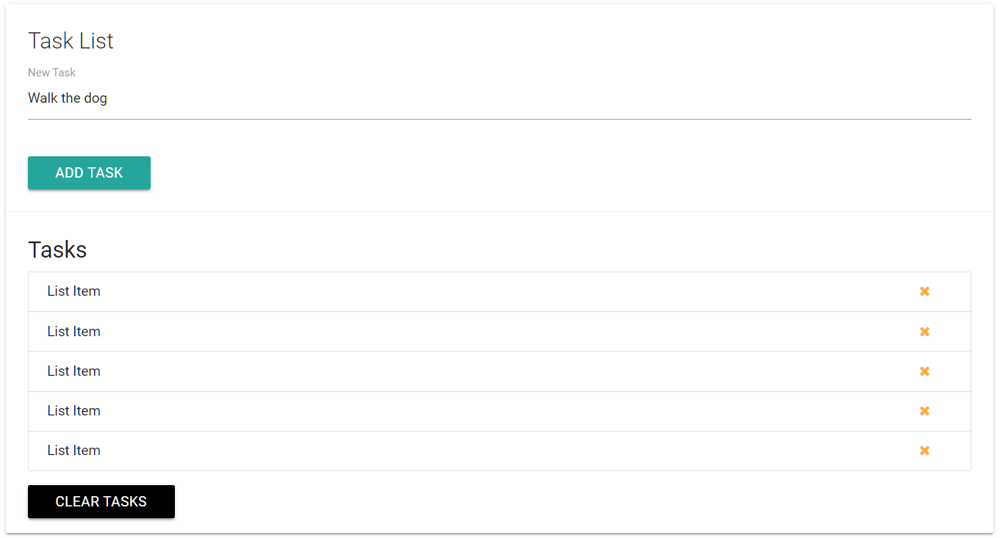

# DOM Manipulation & Events
**Examining the Document object for this project**
- index.html file:
```HTML
<!DOCTYPE html>
<html lang="en">

<head>
    <meta charset="UTF-8">
    <meta name="viewport" content="width=device-width, initial-scale=1.0">
    <meta http-equiv="X-UA-Compatible" content="ie=edge">
    <link rel="stylesheet" href="https://cdnjs.cloudflare.com/ajax/libs/materialize/0.100.2/css/materialize.min.css">
    <link href="https://maxcdn.bootstrapcdn.com/font-awesome/4.7.0/css/font-awesome.min.css" rel="stylesheet"
        integrity="sha384-wvfXpqpZZVQGK6TAh5PVlGOfQNHSoD2xbE+QkPxCAFlNEevoEH3Sl0sibVcOQVnN" crossorigin="anonymous">
    <title>Task List</title>
</head>

<body>
    <div class="container">
        <div class="row">
            <div class="col s12">
                <div id="main" class="card">
                    <div class="card-content">
                        <span class="card-title">Task List</span>
                        <div class="row">
                            <form id="task-form">
                                <div class="input-field col s12">
                                    <input type="text" name="task" id="task" value="Walk the dog">
                                    <label for="task">New Task</label>
                                </div>
                        </div>
                        <input type="submit" value="Add Task" class="btn">
                        </form>
                    </div>
                    <div class="card-action">
                        <h5 id="task-title">Tasks</h5>
                        <ul class="collection">
                            <li class="collection-item">
                                List Item
                                <a href="#" class="delete-item secondary-content">
                                    <i class="fa fa-remove"></i>
                                </a>
                            </li>
                            <li class="collection-item">
                                List Item
                                <a href="#" class="delete-item secondary-content">
                                    <i class="fa fa-remove"></i>
                                </a>
                            </li>
                            <li class="collection-item">
                                List Item
                                <a href="#" class="delete-item secondary-content">
                                    <i class="fa fa-remove"></i>
                                </a>
                            </li>
                            <li class="collection-item">
                                List Item
                                <a href="#" class="delete-item secondary-content">
                                    <i class="fa fa-remove"></i>
                                </a>
                            </li>
                            <li class="collection-item">
                                List Item
                                <a href="#" class="delete-item secondary-content">
                                    <i class="fa fa-remove"></i>
                                </a>
                            </li>
                        </ul>
                        <a class="clear-tasks btn black" href="#">Clear Tasks</a>
                    </div>
                </div>
            </div>
        </div>
    </div>
    <script src="https://code.jquery.com/jquery-3.2.1.js"
        integrity="sha256-DZAnKJ/6XZ9si04Hgrsxu/8s717jcIzLy3oi35EouyE=" crossorigin="anonymous"></script>
    <script src="https://cdnjs.cloudflare.com/ajax/libs/materialize/0.100.2/js/materialize.min.js"></script>
    <script src="app.js"></script>
</body>

</html>
```

```JavaScript
let val;

val = document.all[1];
console.log(val);
/*
	OUTPUT:
	<head>...</head>
*/

val = document.URL;
console.log(val);
/*
	OUTPUT:
	http://127.0.0.1:5500/index.html
*/

// val = document.forms[0].id;
val = document.forms;
console.log(val);
/*
	OUTPUT:
	HTMLCollection [form#task-form, task-form: form#task-form]
	0: form#task-form
	length: 1
	task-form: form#task-form
	__proto__: HTMLCollection
*/

val = document.links[0].className;
console.log(val);
/*
	OUTPUT:
	delete-item secondary-content
*/

val = document.scripts;
console.log(val);
/*
	OUTPUT:
	HTMLCollection(3) [script, script, script]
	0: script
	1: script
	2: script
	3: script
	length: 4
	__proto__: HTMLCollection
*/

// you can turn HTML collections into arrays to use forEach looping
let scripts = document.scripts;
let scriptsArr = Array.from(scripts);

scriptsArr.forEach(function(script) {
  console.log(script.getAttribute('src'));
});

console.log(val);
/*
	OUTPUT:
	https://code.jquery.com/jquery-3.2.1.js
	https://cdnjs.cloudflare.com/ajax/libs/materialize/0.100.2/js/materialize.min.js
	app.js
*/
```
## DOM Selectors for Single Elements
### document.getElementById()
```JavaScript

	const taskTitle = document.getElementById('task-title');

	// Change styling
	 taskTitle.style.color = 'red';
	 taskTitle.style.padding = '5px';

	// Change content
	taskTitle.textContent = 'Task List';
	taskTitle.innerText = 'My Tasks';
	taskTitle.innerHTML = '<span style="color:red">Task List</span>';
```

