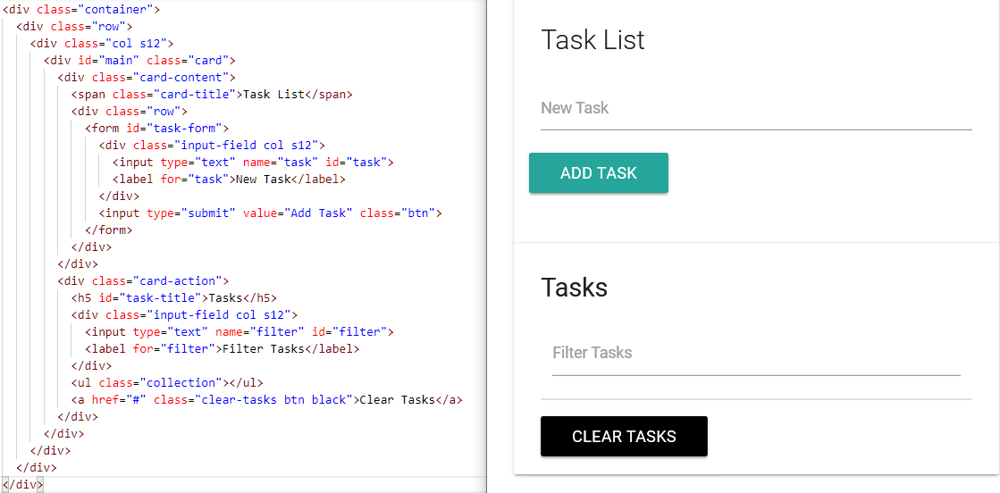
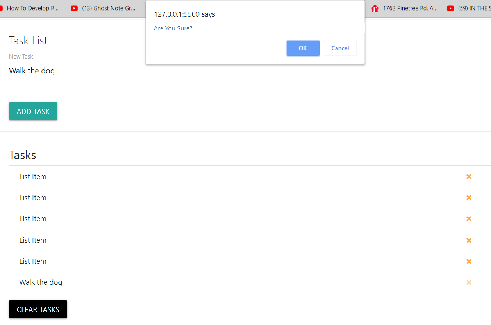
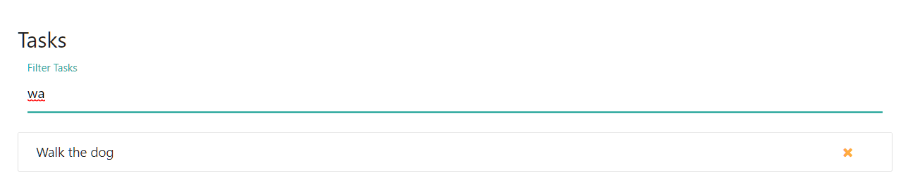

# DOM Manipulation Sample Project

## Part 1 - Add New Task List Items to the Page
*Dynamically add ```<li>``` tags to an unordered list, append ```<a>``` links and inner HTML content to it.*  

1. Add ***materialize*** (responsive front-end framework) to our project. Materialize also needs jQuery as a dependent; download jQuery as well.
  - Here is the link: https://materializecss.com/getting-started.html
  - This tutorial will use the Starter Template - copy files and extract them to your project folder.  
  ***Note:** You'll notice that there are two sets of the files. The min means that the file is "compressed" to reduce load times. These minified files are usually used in production while it is better to use the un-minified files during development.*  

2. Link the files to your webpage. Generally, it is wise to import JavaScript files at the end of the body to reduce page load time. 

```HTML

<!-- Compiled and minified CSS -->
    <link rel="stylesheet" href="https://cdnjs.cloudflare.com/ajax/libs/materialize/1.0.0/css/materialize.min.css">

    <!-- Compiled and minified JavaScript -->
    <script src="https://cdnjs.cloudflare.com/ajax/libs/materialize/1.0.0/js/materialize.min.js"></script>

    <!--JavaScript at end of body for optimized loading-->
    <script type="text/javascript" src="js/materialize.min.js"></script>

```

3. The last external script we add to the project is ***Font Awesome*** - *get vector icons and social logos on your website*.
- Here is the link: Search for “font awesome cdn” -> https://www.bootstrapcdn.com/fontawesome/
- Copy the link and paste under materialize.css in your project.  

*Here is the HTML code and layout of the task list*.  


4. Inside the app.js document add the JavaScript code to dynamically add ```<li>``` elements to the ```ul .collection``` whenever we input a new task inside the task input element; and press the Add Task Button.
```JavaScript
// Define UI Vars
//...get form
const form = document.querySelector('#task-form');
//...get ul 
const taskList = document.querySelector('.collection');
//...get text input
const taskInput = document.getElementById('task');
//...general event-listener
function loadEventListeners() {
    //...listen for form submit and call functions addTask
    form.addEventListener('submit', addTask);
}

function addTask(e) {
    if (taskInput.value === '') {
        alert('Add a task');
    }
    //...create the li elememt
    const li = document.createElement('li');
    li.className = 'collection-item'; // materialize class
    li.appendChild(document.createTextNode(taskInput.value));

    //...create the a tag inside the li element
    const link = document.createElement('a');
    link.className = 'delete-item secondary-content'; // materialize class
    link.innerHTML = '<i class="fa fa-remove"></i>';

    //...append link to li
    li.appendChild(link);
    //...append li to ul
    taskList.appendChild(li);

    e.preventDefault();
}
window.addEventListener('load', loadEventListeners, false);
```
## Part 2 - Delete & Filter Tasks from the List Items
1. When we press the yellow x (```<i>```tag), we want to remove that task from the DOM by using ***event delegation***. This means we must put the event lister onto the ul element. 
  

Add a ‘click’ event listener for the ```<ul>```element that will remove the task from the list to the loadEventListeners() function.
```JavaScript
function loadEventListeners() {
  // Add task event
  form.addEventListener('submit', addTask);
  // Remove task event that will remove the task from the list
  taskList.addEventListener('click', removeTask);
}
```

2. Create the remove function (This will remove a single task ```<li>``` element)
```JavaScript
function removeTask(e) {
    // First, target the i tag 
    if (e.target.parentElement.classList.contains('delete-item')) {
        if (confirm('Are You Sure?')) { // console confirmation
            // Remove the li tag
            e.target.parentElement.parentElement.remove();
        }
    }
}
```  
This is how it looks like in the browser. Click on the yellow x for the task you want to remove; a confirmation will pop up and the list will be removed from the list.


3. Now add functionality for the Clear Tasks Button (This will clear all tasks ```<li>``` elements) 

```JavaScript
// Get the <a> tag(Clear Tasks Button) from the DOM:
  const clearBtn = document.querySelector('.clear-tasks');

// Add a ‘click’ event listener to the clearBtn inside the loadEventListeners() function:
  clearBtn.addEventListener('click',clearTasks);

// Create the Clear Task function:
function clearTasks(){
  //There are two approaches we can use:
	// 1. approach 
  taskList.innerHTML = '';         
  // 2. approach - remove each one; this is a faster process
  while(taskList.firstChild){ // while there still is a firstChild
    taskList.removeChild(taskList.firstChild);
  } 
}
```
4. Filter through the tasks - add a keyup event listener which will fire as soon as we press on the key and let go.
```JavaScript
// Get the input element with the id=”filter” for filtering task events
  const filter = document.querySelector('#filter');

// Add a keyup event listener inside the loadAllEventListerners function for the filter const. 
  filter.addEventListener('keyup',filterTasks);

// Create the Filter Task Function
/* We will use the querySelectorAll() method, which returns a nodeList;  
 * The getElementByClass() method, returns an HTMLCollection;
   - this requires a conversion to an array in order to use a forEach loop.
*/
function filterTasks(e) {
    // get input text value
    const text = e.target.value.toLowerCase();
    // forEach list in the ul
    document.querySelectorAll('.collection-item').forEach(function (task) {
        // get the textNode value
        const liItem = task.firstChild.textContent;
        if (liItem.toLowerCase().indexOf(text) != -1) {
            task.style.display = 'block';
        } else {
            task.style.display = 'none';
        }
    });
    // // same as above... we use ‘=>’ instead of ‘function’
    // liCollection = document.querySelectorAll('.collection-item');
    // liCollection.forEach(element => {
    //     const liItem = element.firstChild.textContent;
    //     if (liItem.toLowerCase().indexOf(text) != -1) {
    //         element.style.display = 'block';
    //     } else {
    //         element.style.display = 'none';
    //     }
    // });
}
  ```  


## Part 3 - Persist to Local Storage

We are going to persist the data to local storage, so that the task actually stays after reloading the page.  

1. Save to Local Storage - add a function call that takes the task as an argument and saves it to Local Storage.
```JavaScript
    // Inside the addTask function, right after we add the task to the DOM
    // Store in LS
    storeTaskInLocalStorage(taskInput.value);

// Store Task to Local Storage
function storeTaskInLocalStorage(task) {
    let tasks;
    if (localStorage.getItem('tasks') === null) {
        tasks = [];
    } else {
        // LS only stores strings, so we have to parse it when it comes out.
        tasks = JSON.parse(localStorage.getItem('tasks'));
    }
    tasks.push(task);
    // and save it as string to LS
    localStorage.setItem('tasks', JSON.stringify(tasks));
}
```  
Now, when we add a task and reload the page, it will disappear from the screen, but when you look at Chrome tools under Application -> Local Storage we will see the task persisted to local storage.  


2. Retrieve from Local Storage 
Create a DOM Load E
vent inside the ```loadEventListerners()``` function by calling the ```DOMContentLoaded``` event listener right on the ```document``` itself; this event will be called right after the DOM is loaded. 

```JavaScript
    // DOM load event - retrieve local storage items.
    document.addEventListener('DOMContentLoaded',getTasks);

    // Retrieves Tasks from Local Storage
    function getTasks() {
        let tasks;
        if (localStorage.getItem('tasks') === null) {
            tasks = [];
        } else {
            tasks = JSON.parse(localStorage.getItem('tasks'));
        }
        tasks.forEach(function (task) {
            // Create li element
            const li = document.createElement('li');
            // Add class
            li.className = 'collection-item';
            // Create text node and append to li
            li.appendChild(document.createTextNode(task));
            // Create new link element
            const link = document.createElement('a');
            // Add class
            link.className = 'delete-item secondary-content';
            // Add icon html
            link.innerHTML = '<i class="fa fa-remove"></i>';
            // Append the link to li
            li.appendChild(link);

            // Append li to ul
            taskList.appendChild(li);
        });
    }
```
3. Delete from Loacal Storage - Add functionality to delete a single task from Local Storage when we click the x icon.  
Insert a statement to the ```removeTask()``` function, that removes a task from the DOM.
```JavaScript 
    // Remove from Local Storage
    removeTaskFromLocalStorage(e.target.parentElement.parentElement);

    // Remove Task from Local Storage
    function removeTaskFromLocalStorage(taskItem) {
        let tasks;
        if (localStorage.getItem('tasks') === null) {
            tasks = [];
        } else {
            tasks = JSON.parse(localStorage.getItem('tasks'));
        }
        tasks.forEach(function (task, index) {
            if (taskItem.textContent === task) {
                
                make sure we delete the right task
                tasks.splice(index, 1);
            }
        });
        localStorage.setItem('tasks', JSON.stringify(tasks));
    }
```  
4. Clear Local Storage - add functionality to delete all tasks from Local Storage.  
Add a statement to clearTasks() function that clears the Local Storage.
```JavaScript
  // Clear from LS
  clearTasksFromLocalStorage();


// Clear the Local Storage
function clearTasksFromLocalStorage() {
    localStorage.clear();
}

```

