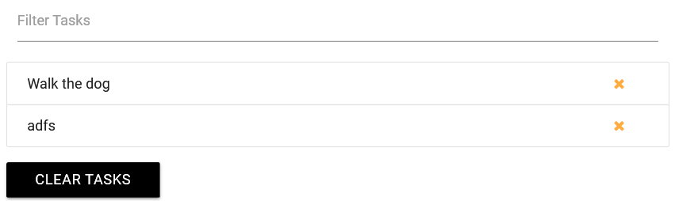

# DOM Manipulation Sample Project

## Part 1 - Add New Task List Items to the Page
*Dynamically add ```<li>``` tags to an unordered list, append ```<a>``` links and inner HTML content to it.*  

1. Add ***materialize*** (responsive front-end framework) to our project. Materialize also needs jQuery as a dependent; download jQuery as well.
  - Here is the link: https://materializecss.com/getting-started.html
  - This tutorial will use the Starter Template - copy files and extract them to your project folder.  
  ***Note:** You'll notice that there are two sets of the files. The min means that the file is "compressed" to reduce load times. These minified files are usually used in production while it is better to use the un-minified files during development.*  

2. Link the files to your webpage. Generally, it is wise to import JavaScript files at the end of the body to reduce page load time. 

```HTML

<!-- Compiled and minified CSS -->
    <link rel="stylesheet" href="https://cdnjs.cloudflare.com/ajax/libs/materialize/1.0.0/css/materialize.min.css">

    <!-- Compiled and minified JavaScript -->
    <script src="https://cdnjs.cloudflare.com/ajax/libs/materialize/1.0.0/js/materialize.min.js"></script>

    <!--JavaScript at end of body for optimized loading-->
    <script type="text/javascript" src="js/materialize.min.js"></script>

```

3. The last external script we add to the project is ***Font Awesome*** - *get vector icons and social logos on your website*.
- Here is the link: Search for “font awesome cdn” -> https://www.bootstrapcdn.com/fontawesome/
- Copy the link and paste under materialize.css in your project.  

*Here is the HTML code and layout of the task list*.  


*The app.js code – we are dynamically adding li elements to our ul .collection tag whenever we input a new task and prses the Add Task Button.*
```JavaScript
// Define UI Vars
//...get form
const form = document.querySelector('#task-form');
//...get ul 
const taskList = document.querySelector('.collection');
//...get text input
const taskInput = document.getElementById('task');
//...general event-listener
function loadEventListeners() {
    //...listen for form submit and call functions addTask
    form.addEventListener('submit', addTask);
}

function addTask(e) {
    if (taskInput.value === '') {
        alert('Add a task');
    }
    //...create the li elememt
    const li = document.createElement('li');
    li.className = 'collection-item'; // materialize class
    li.appendChild(document.createTextNode(taskInput.value));

    //...create the a tag inside the li element
    const link = document.createElement('a');
    link.className = 'delete-item secondary-content'; // materialize class
    link.innerHTML = '<i class="fa fa-remove"></i>';

    //...append link to li
    li.appendChild(link);
    //...append li to ul
    taskList.appendChild(li);

    e.preventDefault();
}
window.addEventListener('load', loadEventListeners, false);
```
## Part 2 - Delete & Filter Tasks from the List Items
When we press the yellow x (```<i>```tag), we want to remove it from the DOM dynamically using event delegation. This means we must put the event lister onto the ul element. 


-	In the loadEventListeners() function, add a ‘click’ event listener to the ul element and the function name:
```JavaScript
function loadEventListeners() {
  // Add task event
  form.addEventListener('submit', addTask);
  // Remove task event
  taskList.addEventListener('click',removeTask);
}
```

-	Create the remove function:
```JavaScript
function removeTask(e){
  // First, target the i tag 
  if(e.target.parentElement.classList.contains('delete-item')){
    if(confirm('Are You Sure?')){                     console confirmation
      // Remove the li tag
      e.target.parentElement.parentElement.remove();
    }
  } 
}
```
-	Now add functionality to the Clear Tasks Button; to clear all task (li elements).

-	Get the ```<a>``` tag(Clear Tasks Button) from the DOM:
```JavaScript
const clearBtn = document.querySelector('.clear-tasks');
```
-	Add a ‘click’ event listener to the clearBtn inside the loadEventListeners function:
```JavaScript
 	// Clear task event
 	clearBtn.addEventListener('click',clearTasks);
```
-	Create the Clear Task function:
```JavaScript
//There are two things that we can do:
function clearTasks(){
	 // 1. 
  taskList.innerHTML = '';         
  // 2. remove each one - 'faster process'
  while(taskList.firstChild){            while there still is a firstChild
    taskList.removeChild(taskList.firstChild);
  } 
}
```
