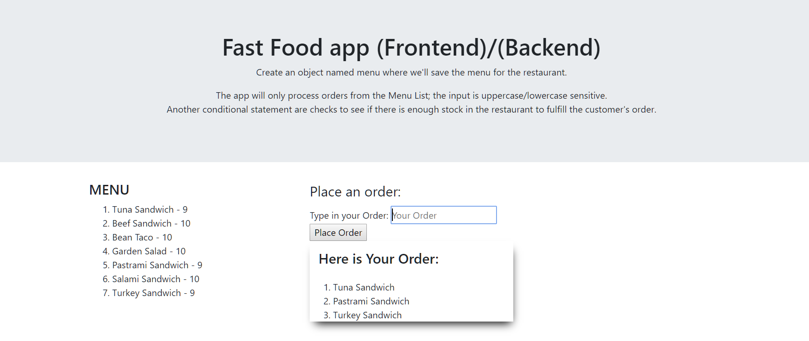

## Fast Food app


- Fast Food app Create an html text input box, our customers are going to put their orders in here.
```HTML
          <form>
            <fieldset>
              <legend>Place an order:</legend>
              Type in your Order: <input type="text" id="txtOrder" placeholder="Your Order"><br>
              <input type="submit" id="btnOrder" value="Place Order" >
            </fieldset>
          </form>
```
- Their orders are going to look like: "1: french fries, 2: shakes" Add an order button.  
  *(The text box will take in orders from the user only if the text is identical to one of the options on the Menu - without the quantity. Make changes if necessary.)*
```HTML
          <form>
            <fieldset>
              <legend>Place an order:</legend>
              Type in your Order: <input type="text" id="txtOrder" placeholder="Your Order"><br>
              <input type="submit" id="btnOrder" value="Place Order" >
            </fieldset>
          </form>
```

- When we click this button it will send our order to the kitchen. Attach a Javascript event listener to the order button and listen for the click event.
```JavaScript
document.querySelector("#btnOrder").addEventListener("click", getOrder);
```

- In the listener take the customer's order and save it to a variable named customerOrder.  
  *(Here we save the state of the input element in a variable. The value will be assigned to customerOrder variable in the getOrder() function.)*
```JavaScript
var order = document.getElementById("txtOrder");
```

- We want to free it up for the next customer's order 
```JavaScript
function clearInput() {
  order.value = "";
}
```
- Bonus Make a string with the customer's order in it and repeat back to the customer what they ordered.  
  *(The fillMenu() function creates a new element and appends it to the ol element. This will display the orders back to the user.)*  

```JavaScript
function fillMenu() {
  let list = document.querySelector("div#menuList ol");

  for (var key in menu) {
    li = document.createElement("li");

    let menuItem = key; //+ menu[key];
    li.innerText = menuItem.replace("_", " ") + " - " + menu[key];
    list.appendChild(li);
  }
}
```
### Section 2
- Fast Food app Create an object named menu where we'll save the menu for the restaurant.
```JavaScript
const menu = {
  Tuna_Sandwich: 10,
  Beef_Sandwich: 10,
  Bean_Taco: 10,
  Garden_Salad: 10,
  Pastrami_Sandwich: 10,
  Salami_Sandwich: 10,
  Turkey_Sandwich: 10
};
```
- Loop through the entire order array In the loop split each item of this array on the colon character.  
  *(Here is a similar solution for this requirement. The fillMenu() functions will loop through the object, replace the "_" character with an empty space " "):*  
```JavaScript
function fillMenu() {
  let list = document.querySelector("div#menuList ol");

  for (var key in menu) {
    li = document.createElement("li");

    let menuItem = key; //+ menu[key];
    li.innerText = menuItem.replace("_", " ") + " - " + menu[key];
    list.appendChild(li);
  }
}
```

- Now that we have the customer's item they would like to order, create a conditional statement and check to see if the customer actually ordered something off of the menu.  
  *(Here customerOrder is the value of the input text for the order. We check if this order exists our menu object)*
```JavaScript 
. . .
   customerOrder = order.value;
   if (checkInventoryOnHand(customerOrder)) {
	 for (var key in menu) {
	   let menuItem = key.replace("_", " ");
	   if (menuItem === customerOrder) {
		 console.log(customerOrder);
. . .
```
- If it doesn't exist log to the console - the customer did not order something off of the menu.  
  *(Change this into a if not exists and an appropriate log)*  
```JavaScript
	   if (menuItem === customerOrder) {
		 console.log(customerOrder);
```

- If the previous statement was true make another conditional statement that checks to see if there is enough stock in the restaurant to fulfill the customer's order.  
  *(Notice that the order value is passed to the checkInventoryOnHand() functions which return a boolean value that checks the inventory on hand.)*
```JavaScript
// Check if the inventory is not 0
function checkInventoryOnHand(order) {
  for (var key in menu) {
    let menuItem = key.replace("_", " ");
    if (menuItem === order) {
      if (menu[key] !== 0) {
        return true;
      } else return false;
    }
  }
}
```
  
- If there is not enough, then let the customer know that you can not fulfill that particular order.  
  (To do so add an else statement after the closing curly bracket for the```if (checkInventoryOnHand(customerOrder)) {``` clause.)

- If the customer ordered something on the menu and it is in stock then deduct the number the customer ordered from the restaurant's stock.  
  *(The deleteFromInventory() function is excepting a parameter which checks if the product exists; and passes it on to the updateProductValue() function which subtracts from the inventory)*  
```JavaScript
// subtract for inventory if it exists:
function deleteFromInventory(product) {
  for (var key in menu) {
    let menuItem = key.replace("_", " ");
    if (menuItem === product) {
      updateProductValue(product);
    }
  }
}

// deduct the number the customer ordered from the restaurant's stock
function updateProductValue(product) {
  var newMenu = {};
  var value;
  Object.keys(menu).forEach(function(key) {
    value = key;
    if (value === product.replace(" ", "_")) {
      newMenu[value] = menu[key] - 1;
    } else {
      newMenu[value] = menu[key];
    }
  });
  // fill the menu with new content:
  for (var key in newMenu) {
    menu[key] = newMenu[key];
  }
  clearMenu();
  fillMenu();
}
```

### Section 3 - 4
- Setup a http server with NodeJS. To do this there is going to have to be a new js file.  
  In that file require in the http and url builtin Nodejs modules and set them to a variable of the same name.  
  *(Note that this is a similar solution. Modify the code if necessary according to your requirements)*  
***server.js file:***  
```JavaScript
/** Creating the SERVER
 * - the server is created here as a separate module - it will be exported and imported in the app.js file!
 * - Include the http-module
 * - Include the url-module
 * - Include the fs-module
 */

var http = require("http");

var fs = require("fs");

class Server {
  createAppServer() {
    // excepting any type of request
    const server = http.createServer((req, res) => {
      fs.readFile("index.html", function(err, data) {
        res.writeHead(200, { "Content-Type": "text/html" });
        res.write(data);
        res.end();
      });
    });
    server.listen(8000, "127.0.0.1", () => {
      console.log("Listening on port 8000");
    });
  }
}
module.exports = Server;
``
